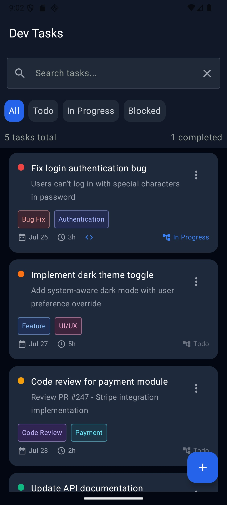

  

###

<h1 align="center">Greetings 👋</h1>

###
<h3 align="left">👨‍💻 About Me</h3>

###

I'm a Senior Mobile Engineer from Tunisia 🇹🇳  
- 🔭 I’m working as a native Android & iOS developer with 7+ years of experience, specializing in Kotlin (Jetpack Compose) and Swift (SwiftUI) 

###

<h3 align="left">🛠 Language and tools</h3>

###

  
  
  
  
  
  
  
  
  
  
  
  
  
  
  
  
  
  
  
  
  
  
  
  
  
  
  
  
  
  
  
  
  
  
  
  
  

---

# 👨‍💻 My Android Portfolio

Welcome to my professional portfolio! Below are some of the Android projects I've worked on—featuring end-to-end development, cross-platform architecture, and modern UI frameworks.

---

## 🧾 DevBuddy (WIP)

**DevBuddy** is a developer-focused to-do list app currently in progress.

- Built using **MVI architecture**, **Jetpack Compose**, **Hilt**, **Navigation**, and **Coroutines**
- Aims to provide a clean, minimal, and code-conscious task manager

**Technologies:** Kotlin, Jetpack Compose, MVI, Hilt, Navigation

**📸 Screenshots:**  
| Screenshot 1 | Screenshot 2 | Screenshot 3 | Screenshot 4 |
|---|---|---|---|
|  |  |  |  |

---

## 📸 Pitchy – Video Creation and Transfer Platform

Built the Android app from scratch using **Kotlin Multiplatform (KMP)** to share logic across Android and iOS.

- Media sync with WorkManager boosted efficiency by 40%
- Custom media selector and multi-upload increased interaction by 30%
- Advanced CameraX view with timer, torch, silhouette guides, and teleprompter
- Full media editor with trim, crop, filters —user engagement up 35%

**Technologies:** KMP, Jetpack Compose, CameraX, FFmpeg, ExoPlayer, Ktor, SwiftUI

**📸 Screenshots:**
| Screenshot 1 | Screenshot 2 | Screenshot 3 | Screenshot 4 |
|---|---|---|---|
|  |  |  |  |

| Screenshot 5 | Screenshot 6 | Screenshot 7 | Screenshot 8 |
|---|---|---|---|
|  |  |  |  |

---

## 🎥 Kannelle – Video Editing & Camera Suite

Migrated UI/UX to Jetpack Compose and SwiftUI, improving responsiveness and performance.

- Improved subtitle generation and export reliability, reducing errors by 50%
- Integrated Shutterstock API, increasing media selection by 30%
- Redesigned camera module using CameraX with accelerometer control, timer, torch, and multi-format video capture
- Built a full-featured media editing suite with trimming, cropping, and filters—boosting engagement by 35%

**Technologies:** Jetpack Compose, SwiftUI, CameraX, WorkManager, Shutterstock API, FFmpeg, ExoPlayer, Kotlin, Swift, Realm, OpenGL, Cube Maps, Coroutines

**📸 Screenshots:**  
| Screenshot 1 | Screenshot 2 | Screenshot 3 | Screenshot 4 |
|---|---|---|---|
|  |  |  |  |

| Screenshot 5 | Screenshot 6 | Screenshot 7 | Screenshot 8 |
|---|---|---|---|
|  |  |  | |

---

## 📱 GpPetrol – Fleet & Fuel Management

Developed server-side DAL and BL layers using **Ktor** and **Kotlin Coroutines**, reducing server response times by 30%.

- Created two Android apps: one for drivers, one for gas stations
- Features include secure authentication, QR code scanning, transaction tracking, and real-time notifications

**Technologies:** Kotlin, Ktor, Coroutines, Jetpack, WorkManager, CameraX, Realm

**📸 Screenshots:**  
| Screenshot 1 | Screenshot 2 | Screenshot 3 | Screenshot 4 |
|---|---|---|---|
|  |  |  | |

---

## 🛍️ 3andi – Online Marketplace App

3andi is an online marketplace app that allows users to sell items, chat with buyers and sellers, and rate products—creating a trusted and interactive commerce experience.

- Users can post and manage listings
- Real-time chat functionality for direct communication
- Product rating system helps build trust and transparency

**Technologies:** Kotlin, Jetpack Compose, Firebase, MVVM, Hilt

**📸 Screenshots:**  
| Screenshot 1 | Screenshot 2 | Screenshot 3 | Screenshot 4 |
|---|---|---|---|
|  |  |  |  |

| Screenshot 1 | Screenshot 2 | Screenshot 3 | Screenshot 4 |
|---|---|---|---|
|  |  |  |  |

---

## 💳 Prepaid Card Tracker

Developed an app to manage and track prepaid card activity.

- Users can view transaction history, transfer funds, receive payments, and make purchases
- Supports multiple card accounts within a single app

**Technologies:** Kotlin, Jetpack Compose, Room, MVVM

**📸 Screenshots:**  
| Demo (GIF) | Screenshot 1 | Screenshot 2 | Screenshot 3 |
|---|---|---|---|
|  |  |  |  |

---

## 📦 Merchant BI Tracker

Created an app to help merchants track transactions across multiple websites.

- Includes a Business Intelligence dashboard to monitor gains and performance
- Real-time data sync and filtering

**Technologies:** Kotlin, Jetpack Compose, Charts, Coroutines

**📸 Screenshots:**  
| Screenshot 1 | Screenshot 2 |
|---|---|
|  |  |

---

## 🔁 Bill Tracker & Payments

Developed a bill management app with built-in payment functionality.

- Users can track bill history and pay directly in-app
- Focus on simple UX and payment reliability

**Technologies:** Kotlin, Jetpack, MVVM, Payment APIs

**📸 Screenshots:**  
| Screenshot 1 | Screenshot 2 |
|---|---|
|  |  |

---

## 🔁 Phone Credit Transfer App

A lightweight app for quickly transferring mobile credit between users.

- Simple UI with fast transaction flow
- Secure verification process

**Technologies:** Kotlin, Jetpack, SMS APIs

**📸 Screenshots:**  
| Screenshot 1 | Screenshot 2 | Screenshot 3 | Screenshot 4 |
|---|---|---|---|
|  |  |  |  |

---

## 🌐 GpPay App

Comprehensive app covering all GPG company services.

- Users can locate merchants on a map, scan product QR codes, and check out via digital wallet
- Includes peer-to-peer fund transfers and real-time merchant updates

**Technologies:** Kotlin, Jetpack Compose, QR APIs, Maps SDK

**📸 Screenshots:**  
| Screenshot 1 | Screenshot 2 | Screenshot 3 | Screenshot 4 |
|---|---|---|---|
|  |  |  |  |

| Screenshot 5 | Screenshot 6 |
|---|---|
|  |  |

---

## 🏦 BNA Event Apps (QR + Wallet)

Developed a series of Android apps for events organized by **Banque Nationale Agricole (BNA)**.

- Users scan QR codes on products and pay using “Tchilla” digital currency
- Custom UI themes per event
- Smooth scan-to-checkout flow with real-time payment validation

**Technologies:** Kotlin, Jetpack, QR Code APIs, Payment SDKs

**📸 Screenshots:**  
| Screenshot 1 | Screenshot 2 | Screenshot 3 | Screenshot 4 |
|---|---|---|---|
|  |  |  |  |

| Screenshot 5 |
|---|
|  |

---

## 💼 Loot – Company Finance & Bill Tracker

Developed an app designed to help businesses track company cash flow, monitor bill payments, and maintain a clear, organized record of all financial transactions.

**Technologies:** Kotlin, Jetpack Compose, Coroutines, MVVM

**📸 Screenshots:**  
| Screenshot 1 | Screenshot 2 |
|---|---|
|  |  |

---

## 💳 Tchilla – Event Payment App for BNA

Developed an Android app for a promotional event in partnership with BNA (Banque Nationale Agricole), showcasing a smooth scan-to-pay experience using the Tchilla digital currency.

- Users scan QR codes on pomegranate products at the event
- Secure payments are made via the Tchilla e-wallet
- Upon successful payment, users are authorized to consume the scanned product
- Demonstrates real-time validation, QR integration, and seamless event-based UX

**Technologies:** Kotlin, Jetpack, QR Code APIs, Digital Wallet Integration, MVVM

**📸 Screenshots:**  
| Screenshot 1 | Screenshot 2 | Screenshot 3 | Screenshot 4 |
|---|---|---|---|
|  |  |  |  |

| Screenshot 5 | Screenshot 6 | Screenshot 7 |
|---|---|---|
|  |  |  |

---

## 🖥️ PFE – Digital Signage App with Xibo CMS

Developed a digital signage Android app integrated with Xibo CMS.

- Users can select and schedule multiple media types: PDF, PowerPoint, images, videos, MP3, GIFs, and Word documents
- Media items can be resized, moved, and layered freely on screen
- Schedules are synced across all Android devices running the app
- The app uses multithreading to manage simultaneous media playback
- Receives SOAP envelopes from the CMS to determine what to display

**Technologies:** Kotlin, Android, Xibo CMS, Multithreading, SOAP

**📸 Screenshots:**  

| Screenshot 1 |
|---|
|  |

---

Feel free to explore the repositories linked above or contact me for more info!
